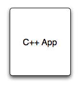
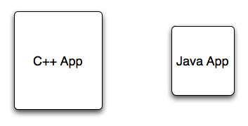
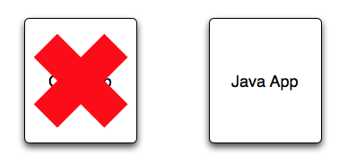
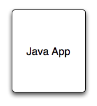
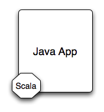
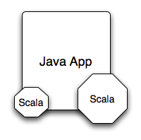

!SLIDE center
# C++ to Java

!SLIDE center
# C++ to Java

!SLIDE center
# C++ to Java

!SLIDE center
# Java to Scala

!SLIDE center
# Java to Scala

!SLIDE center
# Java to Scala

!SLIDE center
# Java to Scala

!SLIDE center
# Don't need to replace your apps

!SLIDE center
# Don't need the entire language

!SLIDE center
# Less risk

!SLIDE center
# Is it realistic?

!SLIDE center
# Does it provide value?
