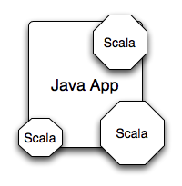

!SLIDE
# How do we make this happen?

!SLIDE bullets incremental
# C++ to Java
* Replace existing apps
* New apps
* New libraries
* New deployment

!SLIDE center bullets incremental
# Java to Scala
* Replace components
* Reuse libraries
* Same deployment

!SLIDE center
# Java to Scala

!SLIDE center
# Java to Scala

!SLIDE center
# Java to Scala

!SLIDE center
# Java to Scala

!SLIDE center
# Don't need to abandon Java

!SLIDE center
# Don't need the entire Scala language to get started

!SLIDE center
# Don't need the entire Scala _library_ to get started

!SLIDE center
# Getting started carries less risk

!SLIDE center
# Is this realistic?

!SLIDE center
# And does this actually provide value?
