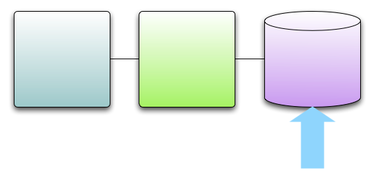
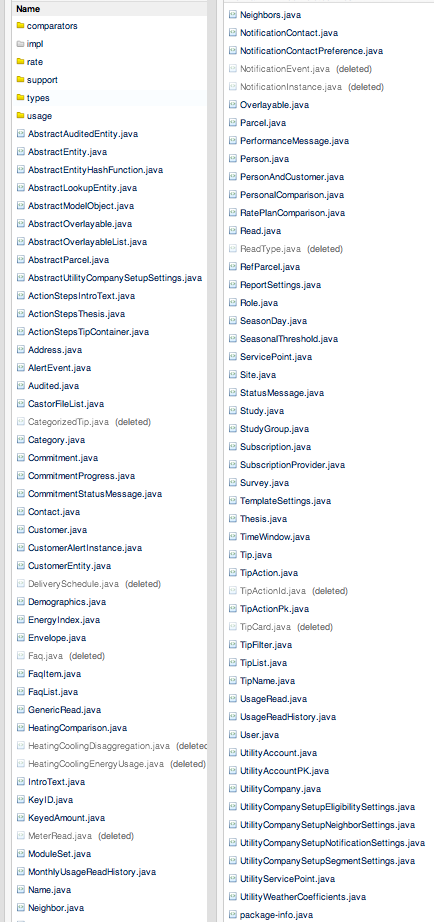

!SLIDE center
# Model/Persistence Layer

!SLIDE smaller
# Model Objects

    @@@ Java
    public class Person {
        private String firstName;
        private String lastName;
        private Date birthdate;
        private char gender;
        private String email;
        public String getFirstName() {
            return firstName;
        }
        public void setFirstName(String firstName) {
            this.firstName = firstName;
        }
        public String getLastName() {
            return lastName;
        }
        public void setLastName(String lastName) {
            this.lastName = lastName;
        }
        public Date getBirthdate() {
            return birthdate;
        }
        public void setBirthdate(Date birthdate) {
            this.birthdate = birthdate;
        }
        public char getGender() {
            return gender;
        }
        public void setGender(char gender) {
            this.gender = gender;
        }
        public String getEmail() {
            return email;
        }
        public void setEmail(String email) {
            this.email = email;
        }
    }

!SLIDE
# Model Objects

    @@@ Scala
    case class Person(
      @BeanProperty var firstName:String,
      @BeanProperty var lastName:String,
      @BeanProperty var birthdate:Date,
      @BeanProperty var gender:Char,
      @BeanProperty var email:String)

!SLIDE bullets incremental
# Low Risk, High Value
* Very little Scala Knowledge
* HUGE reduction in code size
* Very expressive

!SLIDE 
# Two Problems

!SLIDE center
# Already have a ton

!SLIDE center

# Don't make new ones that often

!SLIDE
# Sharp Edges

    @@@ Scala
    case class Person(
      @BeanProperty var firstName:String,
      @BeanProperty var lastName:String,
      @BeanProperty var birthdate:Date,
      @BeanProperty var gender:Char,
      @BeanProperty var email:String,
      // Java ORMs cannot deal with Scala Collections
      @BeanProperty var addresses:List[Address])
