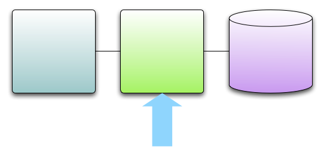

!SLIDE center
# Business Logic

!SLIDE center smaller
# Fully Armed and Operational Programming Language  
[_http://www.flickr.com/photos/flying_cloud/2667225198_](http://www.flickr.com/photos/flying_cloud/2667225198)

!SLIDE small
# Hard to control Learning Curve

    @@@ Scala
    class PersonService {
      this: PersonDAO with UtilityDAO => 

      def login(name:String, password:String) = {
        if (checkPassword(name,password)) 
          val token = recordLogin(name)
          Some(token)
        else
          None
      }
    }

!SLIDE small
# Hard to control Learning Curve

    @@@ Scala
    class PersonService {
      this: PersonDAO with UtilityDAO => 
    //^^^^^ What is this even called?!^^^
      def login(name:String, password:String) = {
        if (checkPassword(name,password)) 
          val token = recordLogin(name)
          Some(token)
        else
          None
      }
    }

!SLIDE

!SLIDE bullets incremental
# High Risk 
* (though arguably high value)
* A win in the long term
* Productivity, Maintainability, Learnability hits in the short term
* Requires on-site or in-house experts (expensive)

