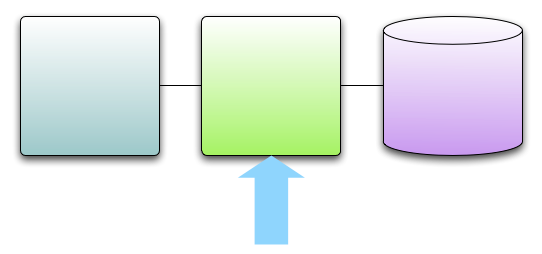

!SLIDE center

!SLIDE smaller
# Business Logic

!SLIDE center
# Fully Armed and Operational Programming Language

!SLIDE 
# Hard to control Learning Curve

    @@@ Scala
    class PersonService {
      this: PersonDAO with UtilityDAO => 

      def login(name:String, password:String) = {
        if (checkPassword(name,password)) 
          val token = recordLogin(name)
          Some(token)
        else
          None
      }
    }

!SLIDE 
# Hard to control Learning Curve

    @@@ Scala
    class PersonService {
      this: PersonDAO with UtilityDAO => 
    //^^^^^ What is the even called?! ^^^
      def login(name:String, password:String) = {
        if (checkPassword(name,password)) 
          val token = recordLogin(name)
          Some(token)
        else
          None
      }
    }

!SLIDE smaller
# Too much, too soon

    @@@ Scala
    object MyParser {
      type E = Expression

      def postfixExp = primaryExp ~ rep(
          "[" ~> expr <~ "]" ^^ { e => ElementExpression(_:E, e) }
        | "." ~ "length" ^^^ LengthExpression
        | "." ~> ident ~ ("(" ~> repsep(expr, ",") <~ ")") ^^ 
          flatten2 { (f, args) =>
            CallMethodExpression(_:E, f, args)
          }
      ) ^^ flatten2 { (e, ls) => collapse(ls)(e) }

      def expr: Parser[E] = ...

      def collapse(ls: List[E=>E])(e: E) = {
        ls.foldLeft(e) { (e, f) => f(e) }
      }
    }

!SLIDE bullets incremental
# High Risk, High Value
* Maintainability
* Learnability
* Searchability
