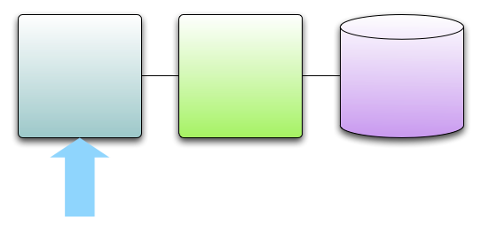

!SLIDE center
# What about application endpoints?

!SLIDE 
# DaveWeb5000 Controller

    @@@ Java
    public class TipController {

      public Object getTip() {
        String id = params.get("id");
        String format = params.get("format");
        Tip tip = tipService.find(id);
        return formatAs(format,tip);
      }
    }

!SLIDE 
# Scala-ized version

    @@@ Scala
    class TipController {

      def getTip = {
        val id = params("id");
        val format = params("format");
        val tip = tipService.find(id);
        formatAs(format,tip);
      }
    }

!SLIDE 
# "Power of Scala" has little to add

!SLIDE 
# Low Risk, Low Value
