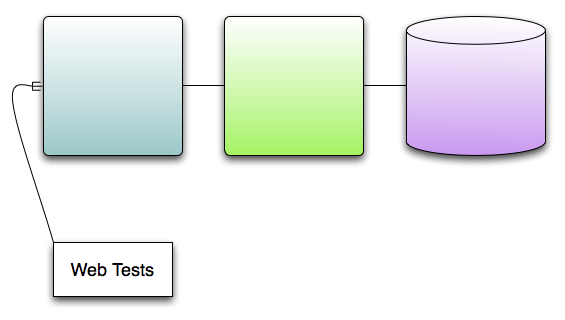

!SLIDE
# What OPOWER did

!SLIDE center
# Web Testing

 
!SLIDE small bullets incremental
# Web Testing
* New Concept for team
* Key to success of product
* New API to learn for everyone
* Can we sneak in Scala?
* (and add value :)

!SLIDE smaller
# HTMLUnit/JWebUnit is like assembly language

    @@@ Java
    public void testLogin {
      tester = new WebTester();
      tester.gotoURL(HOME_PAGE);
      tester.gotoURL(PROTECTED_PAGE);
      tester.assertOnForm("login");
      tester.setValue("user","dave@blah.com");
      tester.setValue("pass","foobar69");
      tester.submit();
      tester.assertOn(PROTECTED_PAGE);
      // Real tests much longer and
      // more painful
    }

