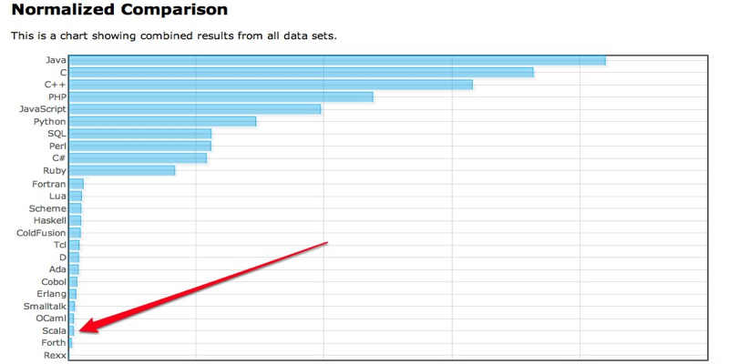
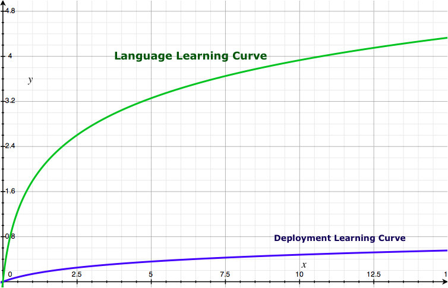
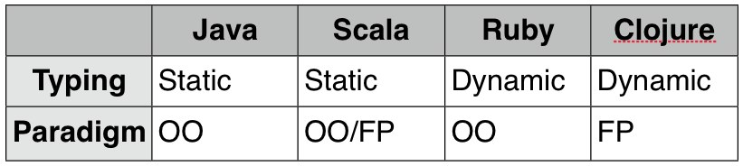
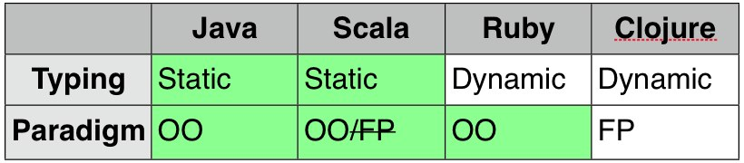

!SLIDE 
# Why _SHOULDN'T_ your company want Scala?

!SLIDE bullets incremental
# Steep learning curve
* New Syntax
* Many new concepts
* Docs, books, community all in early stages

!SLIDE
# C++

    @@@ C
    int above_threshold(EnergyReading readings[], 
            int size) {
      int count = 0;
      for (int i=0;i<size; i++) {
        if (readings[i].kwh > THRESH) {
          count++;
        }
      }
      return count;
    }

!SLIDE
# Java

    @@@ Java
    public int aboveThreshold(
            EnergyReading[] readings) {
      int count = 0;
      for (int i=0;i<readings.length; i++) {
        if (readings[i].getKWH() > THRESH) {
          count ++;
        }
      }
      return count;
    } // no new concepts or syntax here!

!SLIDE
# Scala

    @@@ Scala
    def aboveThreshold(
        readings:Array[EnergyReading]) = 
      readings filter (_.kwh > THRESH) size

!SLIDE
# Java's delivering

!SLIDE center
# Where do I even _find_ a Scala developer?

http://langpop.com/

!SLIDE 
# Why should your company _want_ Scala?

!SLIDE bullets incremental
# Fewer bugs
* More productive
* More expressive

!SLIDE
# Talent attractor

!SLIDE center 
# Deployment curve isn't steep
## 

!SLIDE center
# Natural progression on the JVM

!SLIDE center
# Natural progression on the JVM

